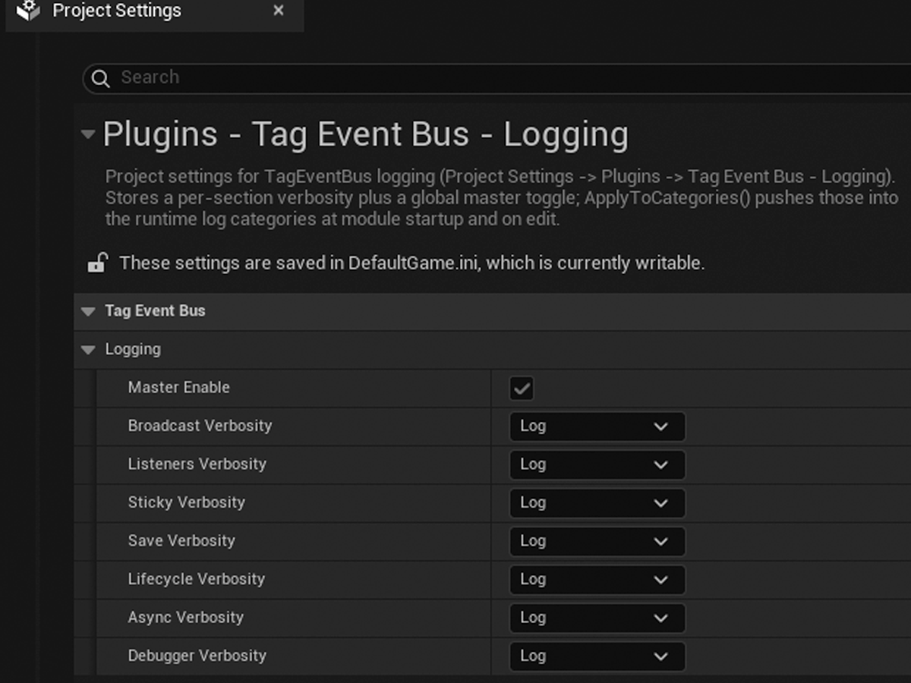

# Configuration

*One mandatory step, two optional ones — and a list of everything that works without any configuration.*

There are three areas to consider: tag registration (the only mandatory step), local bus <!-- fact:konfiguracji-wymagaja-tylko-trzy-rzeczy-rejestracja-tagow-ob -->
setup (if you need one), and configuration for optional modules (where required).
Everything else works right away.

## 1. Tag registration — mandatory

Every tag you broadcast on or listen on has to exist in the project's global Gameplay Tag <!-- fact:rejestracja-tagu-w-globalnym-slowniku-gameplay-tags-to-wymog -->
list. That is a requirement of the engine's own system, not of this plugin, and it is the
only mandatory configuration step.

You add tags in **Project Settings → Project → GameplayTags**, in an `.ini` file, or in a
tag table — whichever route your project uses.

> [!warning]
> A tag outside that list (`!Tag.IsValid()`) is rejected on bind and on broadcast alike. The <!-- fact:tag-spoza-slownika-tag-isvalid-jest-odrzucany-przy-bind-i-pr -->
> Blueprint nodes log a `Warning`, but the low-level C++ API rejects it **silently**. The event is
> not delivered, so tag registration is the first thing to check when an event does not arrive.

A dot in a tag name creates a parent-child hierarchy. That has real consequences for
delivery. [Broadcast path](../concepts/broadcast-path.md) covers them.

## 2. The local bus — only if you need it

The global bus is created automatically. Creating a local bus requires an explicit choice:
add a `UTagEventBusComponent` to an actor, or enable `bCreateLocalIfMissing` when binding.

[Architecture](../concepts/architecture.md) covers the difference
between the two scopes, and why they are not one registry with a filter.

## 3. Optional modules <!-- fact:tageventbusrequests-nie-wymaga-zadnej-konfiguracji-startowej -->

| Module | What it needs |
| --- | --- |
| `TagEventBusRequests` | nothing — the request layer works right away |
| `TagEventBusContracts` | schemas registered in Project Settings; with no registered schema it does nothing |

## Project settings pages

The plugin adds two entries to **Project Settings → Plugins**: "Tag Event Bus - Logging" <!-- fact:plugin-doklada-dwie-strony-do-project-settings-plugins-tag-e -->
and "Tag Event Bus - Contracts". Both write to `Game.ini`. <!-- fact:obie-strony-ustawien-projektu-sa-opcjonalne-wartosci-domysln -->

Both are optional. The defaults are sensible to start with, so there is no reason to open
either page until you actually need something from it.

Every logging section starts at the `Log` level. Console commands
change levels on the fly, with no restart and without opening the settings.
[Debugging](../advanced/debugging.md) covers them.

*The logging settings. Every section starts at the `Log` level, so on day one there is nothing to change here.*

## What works with no configuration

- **The global bus.** `UTagEventBusSubsystem` on the `GameInstance` is created <!-- fact:bus-globalny-utageventbussubsystem-na-gameinstance-jest-twor -->
  automatically and works the moment the plugin is enabled.
- **The in-editor debugger.** No settings at all. <!-- fact:debugger-edytorowy-dziala-od-razu-po-wlaczeniu-pluginu-bez-z -->
- **The request layer.** From the `TagEventBusRequests` module.

---

← [Start here](README.md) · [Documentation index](../README.md)
