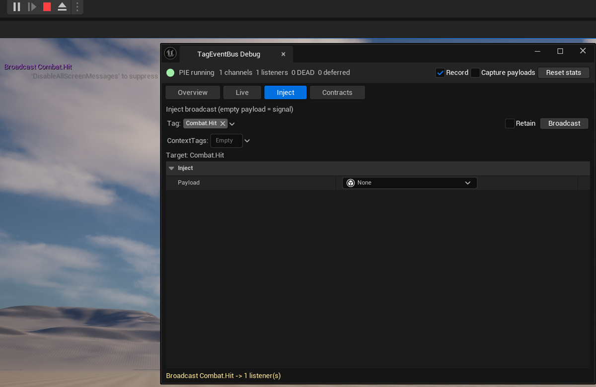

# Verification

*Three checks — from the presence of a menu entry to a manual broadcast that helps you determine whether the problem is on the sender or receiver side.*

## 1. The menu entry

Open **Tools → Debug → TagEventBus Debug**. <!-- fact:obecnosc-pozycji-menu-tools-debug-tageventbus-debug-potwierd -->

The presence of that entry confirms that the plugin is enabled **and** built. The entry comes <!-- fact:pozycja-menu-tools-debug-tageventbus-debug-pochodzi-z-modulu -->
from the editor module, so it proves both at once. That is a stronger <!-- fact:pozycja-menu-debuggera-jest-najmocniejszym-testem-obecnosci -->
test than a checked box in the Plugins browser, which alone does not confirm that the plugin
has built successfully. <!-- fact:brak-pozycji-tools-debug-tageventbus-debug-oznacza-ze-plugin -->

**Entry not there?** The plugin is disabled, or the editor module did not build. Check these in
order:

1. Is the plugin in the Plugins browser list at all? If it is not, the plugin directory is in
   the wrong place — [Installation](installation.md).
2. Did you restart the editor after enabling the plugin by hand?
3. Did the build in the Development Editor configuration pass without errors?

## 2. The panel opens

Open the panel outside a PIE session and it says "Start Play In Editor to see live data."
That message is the check passing: the panel is there and knows there is nothing to show yet.
What it displays once the game runs is on the [Debugger](../concepts/debugger.md) page — and it
starts from zero in every session, because [each PIE session runs on its own
bus](../concepts/architecture.md).

## 3. An event reaches its listener

Start Play In Editor and broadcast by hand from the panel's **Inject** tab, on the tag your
receiver listens for. The delivery count in the panel's reply tells you whether anything is
listening at all — the [Debugger](../concepts/debugger.md) page walks through the tab and how
to read that count.

This is the check worth running before you suspect your own code: it tests delivery without
the original sender, and it works before that sender exists.

*The Inject tab during a PIE session, with the panel's reply to a manual broadcast.*

## When nothing arrives even after these checks

The installation is fine and the problem is elsewhere. Start from the ordered checklist in
[Common problems](../troubleshooting/common-problems.md) — it goes from the cheapest check to
the most expensive one, and the first two catch most cases.

---

← [Start here](README.md) · [Documentation index](../README.md)
